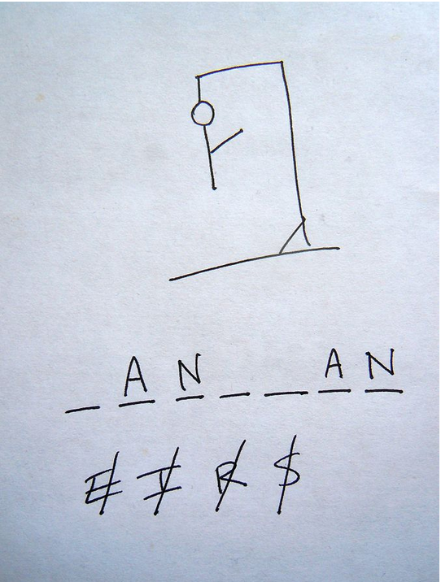

# Hangman

## Description

Here we have a game called Hangman, with player's object to identify a hidden letter. In each round, the player guesses a letter of alphabet: if the letter is present in the word rondomly selected to be guessed the latter will be revealed and on and on unitill the player guess all the letters, then the game ends in win if all letters are guessed,and ends in loss if the live provided is reachis zero.

For this game, there was already provided list of words where randomly a word was selected. At the start of the game a name will be asked just for the purpose of welcoming and congratulation message.

## Python version

Python 3.6.9

## Installation

To play this game the following is needed: 
- Python3 installed in your system.
- A Git hub account
- Pull repository named git@github.com:BiniamBerhe/hangman.git

## Usage

After installation is done, open your terminal and navigate to the directory where hangman is located, and type python3 or python main.py

make sure you don't change any of the files presented!.

## Who
Biniam Berhe

## Timeline

26/01/2022 to 27/01/20222 10:40

## Personal situation
**All and all best python beginner level project challenge!! :)**
